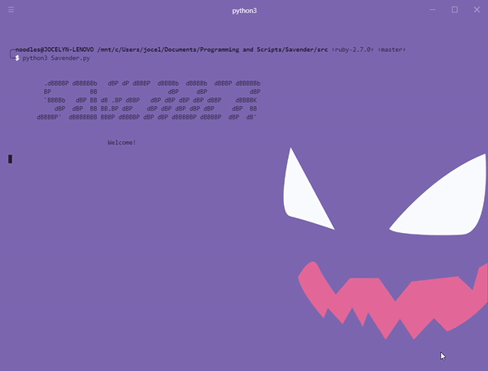

  

A CLI-based tool in Python that lets users get songs and movie recommendations based on their likes and preferences.
## Requirements
The main driver program is `src/Savender.py`. Python 3.x is required to run this application. To download the required modules for using, clone this repo and run `pip install -r requirements.txt`. You will also need to get the Spotify client ID and secret (through the developer portal) and the key for the TMDB API to run this program and communicate with the APIs. 
## Demo

## More Info
[DevPost where you can read more into the thought process behind this project](https://devpost.com/software/savender)
